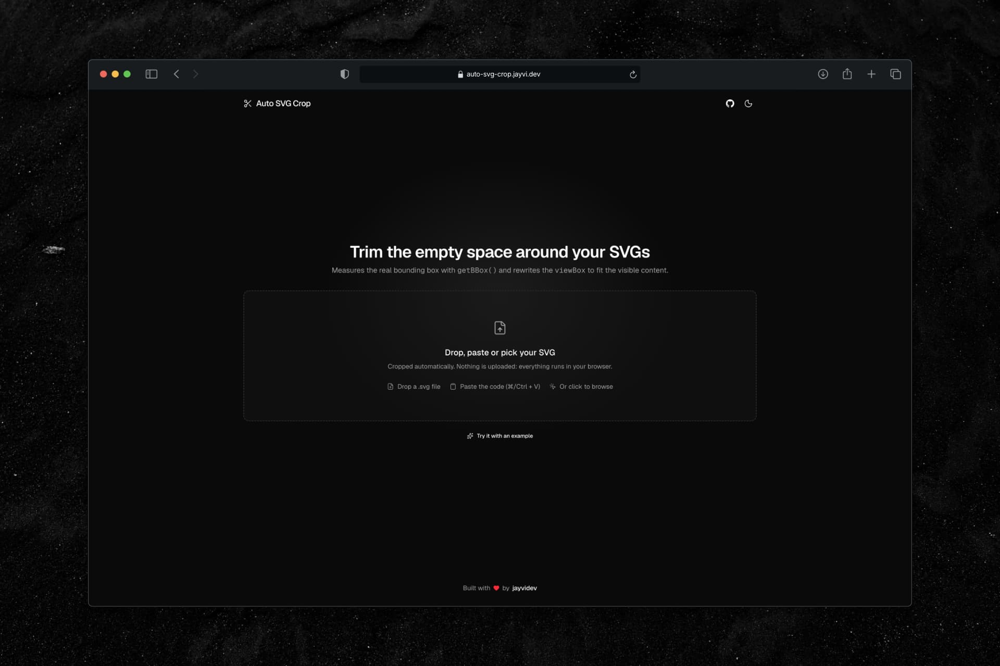

<div align="center">
  <a href="https://auto-svg-crop.jayvi.dev">
    
  </a>
  <p></p>
</div>

<div align="center">

# auto-svg-crop.jayvi.dev


</div>

A client-side tool that trims the empty space around an SVG: it measures the real bounding box with `getBBox()` and rewrites the `viewBox` to fit the visible content. Nothing is uploaded — every step runs in the browser.

## Tech Stack & Features

- **SvelteKit 2 + Svelte 5** (runes), Vite 8, TypeScript strict, Vercel adapter, Tailwind v4 (via `@tailwindcss/vite`), Geist font.
- **Drop it anywhere**: drag a `.svg` onto any part of the page, paste code or a file with `⌘/Ctrl + V` from anywhere, or click the dropzone to browse.
- **Cropping engine** in [`src/utils/cropSvg.ts`](./src/utils/cropSvg.ts): renders the SVG off-screen, reads `getBBox()`, rewrites the `viewBox`, drops `width`/`height` and reports the trimmed area.
- **Before / after comparison** — both previews share one box, and the original is drawn with its bounding box outlined and the removed space dimmed.
- Optional **SVGO** optimization, remembered in `localStorage`, plus copy, download and syntax-highlighted output (Shiki, dual light/dark themes).
- **shadcn-svelte** components (bits-ui + tailwind-variants) with light and dark mode via `mode-watcher`.

## Quickstart

```bash
pnpm install
pnpm dev                     # site → http://localhost:5173
```

## Scripts

| Script | What |
|--------|------|
| `pnpm dev` / `build` / `preview` | SvelteKit app |
| `pnpm check` / `check:watch` | Type-check with `svelte-check` |
| `pnpm lint` / `lint:fix` / `format` | ESLint + Prettier |

## License

MIT
